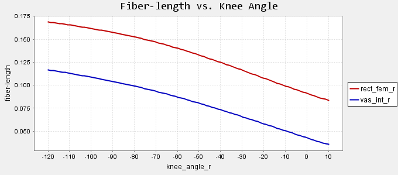
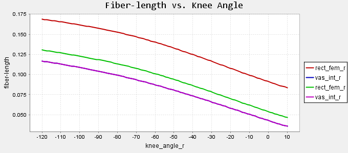
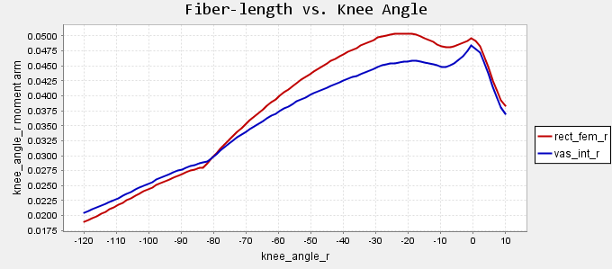
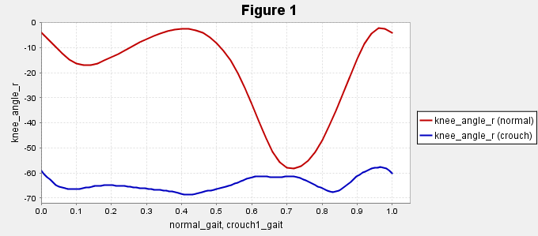
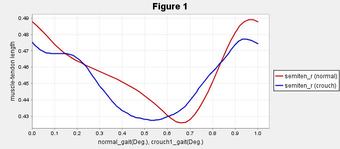

# Tutorial 1: introduction to musculoskeletal modeling

[link to OpenSim](https://simtk-confluence.stanford.edu:8443/display/OpenSim/Tutorial+1+-+Intro+to+Musculoskeletal+Modeling)

- Musculoskeletal (_MSK_) modeling enable to study neuromuscular coordination, analyze performance and estimate MSK loads
- In OpenSim, a MSK model consists of **rigid body segments** connected by **joints**
    - Muscle span these joints and generate forces and movement

## MSK model of the lower extremity
1. load the model `3DGaitModel2392`
2. load kinematic data in `Gait2392_Simbody\Tutorial1` (`normal.mot`)

### Question
1. Degrees of freedom
    a. Use the Coordinate slider to view the degrees of freedom of the model. How many degrees of freedom does the model have?
  
    > there is 23 DoF.
  
    b. All models are approximations. Compare the degrees of freedom in the model to the degrees of freedom in your lower limbs. Which motions have been simplified? Which motions have not been modeled at all?
    
    > 3 DoF in the ankle.
    
2. Muscle Paths

    a. How many muscles are in the model? Is this greater than the number of degrees of freedom? What is the minimum number of muscles required to fully actuate the model?
    
    > There is 53 muscles, which is more than the number of DoF. There is 23 DoF, and we need at least two muscles to activate each DoF. So we need two times the DoF $\rightarrow 46$ muscles
    
    b. In this model, the gluteus medius is represented by multiple lines of action (e.g., glut_med1_r, glut_med2_r, glut_med3_r). Name two other muscles in the model that are represented with multiple lines of action. Why do you think these muscles are represented in this way?
    
    > `glut_max`, `add_mag` and `glut_min` for example.
    
    c. Which knee extensor muscles have wrapping points? At what knee angle does the wrapping point appear for each of those knee extensors? A muscle may have more than one wrapping point.
    
    > The four muscles have wrapping points:
    - `rect_fem_r`: 85 flexion
    - `vas_int_r`: 83 flexion
    - `vas_lat_r`: 70 flexion
    - `vas_med_r`: 70 flexion
    
3. Modeling limitations

    a. Zoom in on the right hip, and display only the glut_med3_r muscle (r hip extensors group). Examine this muscle for the full range of hip flexion angles. Do you see any problems with glut_med3_r ? In what ways are point-to-point representations of muscle paths a simplification of musculoskeletal geometry?
    
    > in extreme RoM, the muscle pass through the bones.
    
## Joint angles, muscle-tendon lengths and moment arms

- muscle-tendon lengths and moment arms depend on limb configuration
- muscle-tendon forces depend upon the muscle-tendon length
- joint moments depend upon muscle-tendon forces and moment arms


(ref:dependon) Joint angles, muscle-tendon lengths and moment arms.

```{r dependon, fig.width=7, fig.asp=0.618, out.width="80%", fig.align='center', fig.cap='(ref:dependon)'}
knitr::include_graphics("./fig/dependon.pdf")
```


### Questions

4. Muscle Fiber Length vs. Joint Angle

    a. Study the plot of muscle fiber length vs. knee angle. Do you think these curves would look different if, for example, the right hip was flexed?
    
(ref:plot1) Muscle Fiber Length vs. Joint Angle.

```{r plot1, echo=F, fig.align='center', fig.asp=0.618, fig.cap='(ref:plot1)', fig.width=7, out.width="80%"}

```

    > The curve of the `rect_fem_r` would looks different if the hip was flexed because this muscle is attached on the hips.

    b. You will now flex the right hip by recalling the pose you previously saved. Compare the two sets of curves you have just plotted. How have the curves changed? Can you explain your findings? How can bi-articular muscles complicate analysis?
    
(ref:plot2) Muscle Fiber Length vs. Joint Angle with hip flexed.

```{r plot2, echo=F, fig.align='center', fig.asp=0.618, fig.cap='(ref:plot2)', fig.width=7, out.width="80%"}

```

    > The curve of the `rect_fem_r` looks different: the muscle-tendon length is shorter for the same joint knee angle. This makes sense because this muscle is attached to the hip and the hip is flexed so it's the muscle is shorter. Muscle-tendon length is dependent on the joint kinematics, so bi-articular muscles depend on two joints, which complicate analysis.
    
5. Muscle Moment Arm vs. Joint Angle

Muscle moment arm
  ~ measure the effectiveness of a muscle at contributing to a particular motion over a range of configurations
  ~ moment arm is the distance from line of action to joint center
  
    a. Study the plot of knee extension moment arm vs. knee angle for rectus femoris and vastus intermedius. At what knee angles do the moment arms peak? What are the peak moment arms?
    
(ref:plot3) Knee extension moment arm vs. knee angle for rectus femoris and vastus intermedius.

```{r plot3, echo=F, fig.align='center', fig.asp=0.618, fig.cap='(ref:plot3)', fig.width=7, out.width="80%"}

```

    > the moment arms peak at 20 degree of flexion (0.05\ m)
    
    b. You may notice that the moment arm curves have a discontinuity. At what knee angle do the discontinuities occur? What do you think causes this? Hint: Look at Question 2.b
    
    > The discontinuities occur at 80 degree of flexion, when the via-points appeared
    
## Assessment of hamstring length during crouch gait
- One hypothesized cause of crouch gait is short hamstrings

6. Range of Motion

    a. What differences do you observe between crouch gait and normal gait?
    
    > Hip, knee and back more flexed
    
    b. What is the "normal" range of knee flexion during stance phase? How does this knee flexion curve for crouch gait compare to the normal gait data?
    
(ref:plot4) knee angle during normal and crouch gait.

```{r plot4, echo=F, fig.align='center', fig.asp=0.618, fig.cap='(ref:plot4)', fig.width=7, out.width="80%"}

```

    > normal range of motion: 0:60 degrees. Crouch gait stay flexed at 60-70 degrees
    
7. Hamstring length

    a. Study the curves. Based on the plot, what recommendation would you give the surgeon? Can you think of any limitations of your analysis?
    
(ref:plot5) knee angle during normal and crouch gait.

```{r plot5, echo=F, fig.align='center', fig.asp=0.618, fig.cap='(ref:plot5)', fig.width=7, out.width="80%"}

```

    > Lengthen the hamstrings of .1\ m
    
# Tutorial 2: Simulation and Analysis of a Tendon Transfer Surgery

